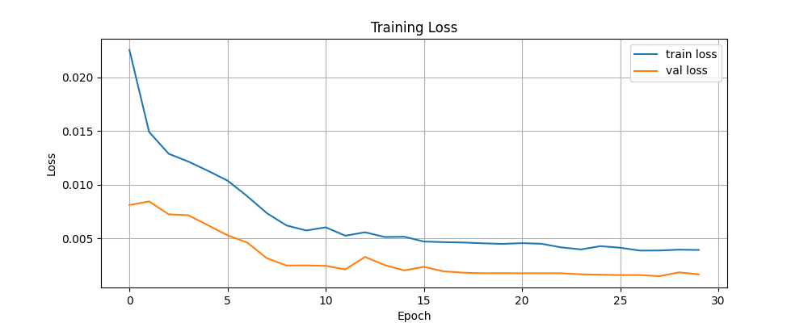
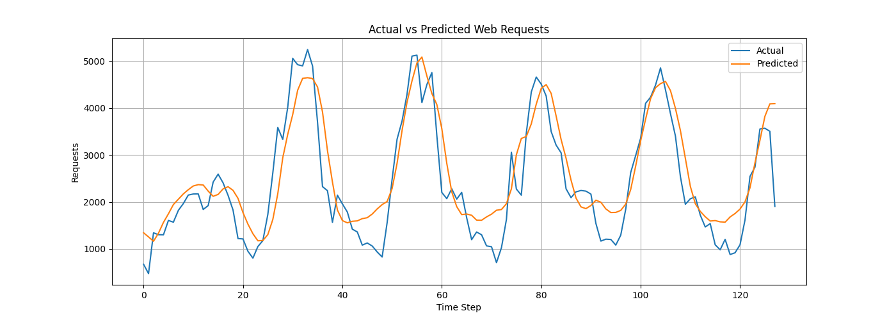

# 🚀 LSTM Workload Prediction: 시계열 기반 워크로드 예측 모델

## 📌 프로젝트 개요
NASA 웹 서버 로그 데이터를 기반으로 트래픽(요청 수)을 예측하는 LSTM 기반 시계열 모델을 구현했습니다.  
실제 서버 부하를 예측하여 클라우드 자원 관리에 활용할 수 있는 모델을 목표로 합니다.

---

## 🎯 프로젝트 목적
- 시계열 데이터 기반 트래픽 예측 모델 구축
- LSTM 구조 이해 및 실습
- 실제 로그 데이터를 활용한 데이터 전처리 및 모델링 경험

---

## 📊 데이터셋
- NASA Web Server Access Log (July 1995)
- 시간 단위 요청 수로 변환하여 시계열 데이터 구성

---

## ⚙️ 사용 기술
- Python
- NumPy / Pandas
- TensorFlow / Keras
- Matplotlib
- Google Colab

---

## 🧠 모델 구조
- Input: 시간 순서 데이터 (요청 수)
- LSTM Layer
- Dense Layer (Output)

---

## 📈 결과

### 🔹 Training Loss

### 🔹 Actual vs Predicted

---

## 🔍 주요 과정

### 1. 데이터 전처리
- 로그 데이터를 시간 단위로 집계
- 정규화 및 시계열 데이터 생성

### 2. 모델 학습
- LSTM 기반 시계열 예측 모델 구성
- 손실 함수 기반 학습 진행

### 3. 결과 분석
- 실제 값과 예측 값 비교
- 모델 성능 평가

---

## 🚧 한계 및 개선 방향
- 데이터 기간이 짧아 일반화 성능 제한
- 다양한 하이퍼파라미터 튜닝 필요
- 다른 웹 로그 데이터로 확장 가능

---

## 📁 프로젝트 구조
